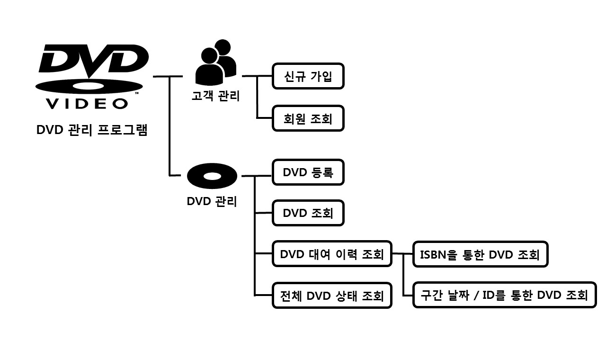
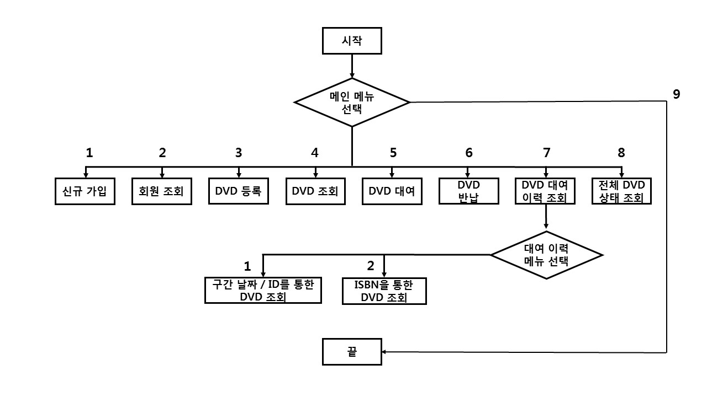
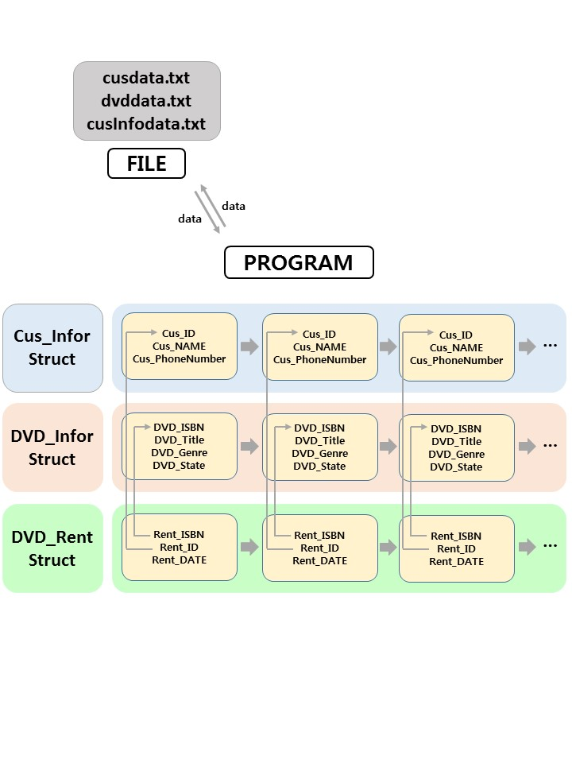
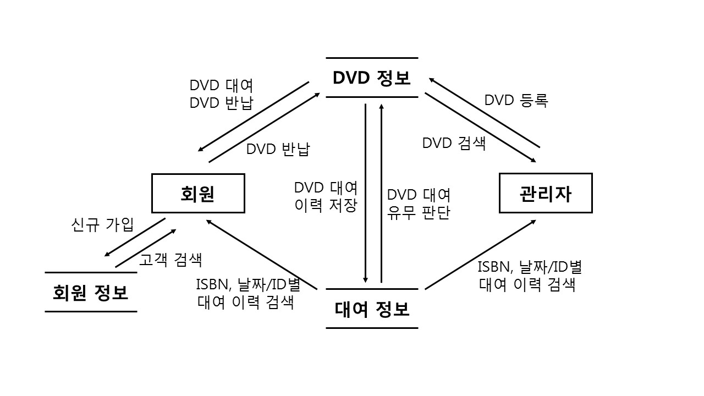

# DVDManage

# **SW 개발 기술 문서**

[DVD 대여 관리 프로그램]

**하 승 민**

## **1. 개요**

 -  본 DVD 대여 관리 프로그램은 고객 관리, DVD 관리 및 대여, 이력 조회를 전상 상으로 처리할 수 있도록 구현 되어있다. 파일 입출력을 통하여 데이터를 파일로 유지 할 수 있다.
 
 ## **2. 프로그램 순서도**
 
 ## **3. 시스템 구조도**

 - 본 프로그램은 구조체 포인터 배열을 이용하여 구현되어 있으며, 프로그램 시작과 종료 시 각각 파일로 읽고 쓰면서 고객 데이터, DVD 데이터, 대여 이력 데이터들을 유지하도록 구성하였다. 파일은 프로젝트 폴더에 생성되며, 저장되는 데이터 형식은 아래와 같다.

● 고객 데이터 (cusdata.txt) : “ID/고객이름/전화번호/”
● DVD 데이터 (dvddata.txt : “ISBN/제목/장르/대여상태”
● 대여 이력 데이터 (dvdinfodata.txt) : “ISBN/고객ID/대여일/”

각각의 구조체 멤버의 구성은 위 그림과 같다. DVD_Rent Struct의 Rent_ISBN 과 Rent_ID는 DVD_Infor Struct의 DVD_ISBN, Cus_Infor Struct의 Cus_ID와 각각 비교하여, 해당 구조체의 다른 정보를 출력 할 수 있다.

## **4. 기능 및  메시지 일람**

### **1 – 1. 프로그램 실행**

기 등록된 데이터가 존재하면 "기 등록된 OO데이터 불러오는 중..." 메시지 출력
프로그램 실행 시 메인화면 전에 출력되는 화면으로, 기존 데이터 유무 출력

기 등록된 데이터가 없으면 "기 등록된 OO데이터가 없습니다" 메시지 출력

### **1 – 2. 메인화면 실행**

1. 신규가입
  신규 회원 가입화면으로 이동
2. 회원조회
  등록된 회원 조회화면으로 이동
3. DVD등록
  신규 DVD 등록화면으로 이동
4. DVD조회
  등록된 DVD조회 화면으로 이동
5. DVD 대여
  DVD 대여화면으로 이동
6. DVD 반납
  DVD 반납화면으로 이동
7. DVD 대여 이력 조회
  DVD 대여 이력 조회 화면 이동
8. 전체 DVD 대여 상태
  전체 DVD 목록 조회 화면 이동
9. 종료>>프로그램종료 
 프로그램 메인 화면으로 메뉴 번호를 입력 받아 해당화면 으로 이동.

### **2 – 1. 신규 가입**

 신규 회원을 등록하는 화면으로 고객ID(최대10자), 이름(최대30자), 전화번호(최대30자)를 입력 받는다. 해당 정보는 Cus_Info  Struct의 Cus_ID, Cus_NAME, Cus_PhoneNumber에 저장한다.

 모든 회원 정보를 정상적으로 입력하였을 때, 등록 완료 메시지 출력. 회원정보를 담고있는  Cus_Infor 구조체에 저장된다.

 이미 가입돼있는 ID를 입력 하였을 때, 등록 실패 메시지 출력. cusInfoAccess.c의AddCusInfo 함수 반환값을 통해 중복 유무 확인. (포인터 반환>>성공, 0반환>>이미 등록된 ID)

### **2 – 2. 회원 조회**

 등록된 회원 ID를 간단하게  출력하며, 조회할 회원 ID를 입력 받는다. 조회하고자 하는 회원의 ID를 입력받는다.

 회원 ID를 정상적으로 입력하면, 입력받은 회원의 ID, 이름, 전화번호를  출력한다.
 cusManager.c의 SearchCusInfo함수를 통해 입력받은 ID와 Cus_Info 구조체에 저장된 ID를 비교하고,  ID가 동일한 열의 다른 멤버를 ScreenOut.c의 ShowCustomerInfo함수를 통해 출력한다.

 미등록된 ID를 입력하면, "등록되지 않은 ID입니다."  메시지 출력. cusInfoAccess.c의getCusPtrbyID함수를통해등록여부를판단. (0반환 – 미등록, 1반환 – 등록)

### **3 – 1. DVD 등록**

 DVD를 등록하는 화면으로 DVDISBN (최대30자), title( 최대30자), 장르 (1. ACTION, 2. COMIC, 3 . SF, 4. ROMANTIC)를 입력받는다. 대여 상태는 등록 시 자동으로 0(대여 가능) 상태로 등록된다. 해당 정보는 DVD_Info Struct의 DVD_ISBN,  DVD_Title, DVD_Genre, DVD_State에 저장한다.

 모든 DVD 정보를 정상적으로 입력하였을 때, 등록 완료 메시지 출력. DVD정보를 담고있는 DVD_Infor 구조체에 저장된다.

 이미 등록 돼 있는 ISBN를 입력하였을 때, 등록 실패 메시지 출력
 dvdInfoAccess.c의AddDVDInfo 함수 반환 값을 통해 중복 유무 확인.
 포인터가 반환되면 성공적으로 등록된 것이고, 0이 반환되면 이미 등록 된 ISBN이다.

### **3 – 2. DVD 조회**

 등록된 DVD ISBN를 간단하게  출력하며, 조회할 DVD ISBN을 입력 받는다. 조회하고자 하는 DVD의 ISBN을 입력받는다.

 ISBN를 정상적으로 입력하면, 입력받은 DVD의 ISBN, Title,  장르, 대여상태를 출력한다.
 dvdManager.c의 SearchDVDInfo함수를 통해 입력받은 ISBN과 DVD_Info 구조체에 저장된 ISBN을  비교하고, ISBN이 동일한 열의 다른 멤버를 ScreenOut.c의 ShowDVDInfo함수를 통해 출력한다.

 미등록된 ISBN을 입력하면, "등록되지 않은  ISBN입니다." 메시지 출력
 dvdInfoAccess.c의getDVDPtrbyISBN함수를 통해 등록 여부를 판단.
 0이 반환되면 미등록 된 ISBN이고, 1이 반환되면 등록된 ISBN이다.

### **3 – 3. DVD 대여**

 등록된 DVD를  간단하게 출력하며, 대여 가능한 ISBN을 입력받아 대여를 실행 할 수 있는 화면, 대여하고자 하는 DVD의 ISBN, 대여 고객 ID,  대여 날짜를 순차적으로 입력받는다.
 DVD 대여 정보를 담고있는 DVD_Rent Struct의 Rent_ISBN,  Rent_ID, Rent_DATE에 저장하고, 입력받은 ISBN과 DVD_Info 구조체에 저장된 ISBN을 비교하고, ISBN이 동일한  열의 state 멤버 변수를 1로 변경시킨다.

 ISBN, 대여할 회원 ID, 대여 날짜를 모두 정상적으로 입력하면 대여  완료 메시지 출력
 DVD대여 정보를 담고있는 DVD_Rent 구조체에 저장된다.

 등록되어 있지 않은 ID/ ISBN를 입력하면, "등록되어 있지  않은 ID/ISBN입니다." 메시지 출력 후 메인화면으로 이동. getDVDPtrbyISBN 함수를 통해 ISBN 등록 여부를 판단 / getCusPtrbyID함수를 통해 ID등록 여부를 판단.
 

 대여중인 ISBN를 입력하면, "대여중인 DVD입니다." 메시지 출력 후 메인화면으로 이동
 입력받은 ISBN과 DVD_Info 구조체에 저장된 ISBN을 비교하고, ISBN이 동일한 열의 state 멤버를 확인하여 대여  가능여부 판단 ( 0 일 경우 대여가능, 1일 경우 대여불가)

### **3 – 4. DVD 반납**

 대여중인 DVD의 ISBN을  입력받아 반납을 실행 할 수 있는 화면
 키보드를 통하여 반납할 DVD의 ISBN을 입력받는다.

 정상적으로 대여중인 DVD의 ISBN을 입력받으면 "반납이 완료되었습니다."메시지 출력
 입력받은 ISBN과 DVD_Info 구조체에 저장된 ISBN을 비교하고, ISBN이 동일한 열의 state 멤버 변수를 0으로  변경시킨다.

 등록되어 있지 않은 ISBN를 입력하면, "등록되어 있지 않은 DVD입니다." 메시지 출력 후 메인화면으로 이동. getDVDPtrbyISBN 함수를 통해 ISBN 등록 여부를 판단
 

 대여중이 아닌 ISBN를 입력하면, "대여 중인 DVD가  아닙니다." 메시지 출력 후 메인화면으로 이동. 입력받은 ISBN과 DVD_Info 구조체에 저장된 ISBN을 비교하고, ISBN이 동일한 열의 state 멤버를 확인하여 반납  가능여부 판단 ( 0 일 경우 대여가능, 1일 경우 대여불가)

### **4 – 1. DVD 대여 이력 조회**

1. ISBN을 통한 DVD 대여 이력 조회 화면으로 이동
2. 날짜 구간 / 특정 ID를 통한 DVD 대여 이력 조회 화면으로 이동
3. 그 외 입력 "잘못된 입력입니다. 메인화면으로     이동 합니다." 메시지 출력, 이동

메뉴 번호를 입력받아 해당 화면으로 이동한다. 1, 2 외에 다른 입력 시  메인화면으로 복귀한다.

### **4 – 2. ISBN**

 조회할 DVD의 ISBN을 입력받는 화면. 키보드를 통하여 DVD ISBN을 입력받는다.

 대여 이력이  있는 DVD ISBN을 입력한 경우 고객 ID, 이름 , 전화번호, 대여일 출력
 dvdInfoSearch.c의 InforDVDBASIC함수를 통해 출력

### **4 – 3. 구간 날짜 / 특정 ID**

조회할 DVD의 날짜 구간 / 특정  ID를 입력받는 화면. 키보드를 통하여 날짜 구간 / 특정 ID를 입력받는다.

대여 이력이  있는 날짜와 ID를 입력한 경우 DVD ISBN과 대여일 출력. dvdInfoSearch.c의 InforDVDDETAIL함수를 통해 출력

### **5 – 1. DVD 전체 정보 출력**

 등록된 DVD의 전체 정보를 출력하는 화면.
등록된 모든 DVD의 ISBN, Title, 장르, 대여 상태를 출력하고 대여 불가상태일 경우 대여 중인 ID와 대여 날짜를 함께 출력하는 화면
 dvdInfoSearch.c의 inforDVDTOTAL함수를 통해  모든 DVD 정보를 출력

## **5. 개발 환경**

■ 운영체제 : Windows7 Professional K
■ 컴파일 버전(언어) : _MSC_VER 1916
■ CPU : Intel(R) Core(TM) I7-4790 CPU @ 3.60GHz
■ 메모리 : 8GB
■ IDE :　Microsoft Visual Studio Community 2017 15.9.6

## **6. 데이터 흐름도**

## **7. 결과**

### **7.1 기대효과**
- 본 프로그램을 통하여 고객 관리와 DVD 관리를 할 수 있고, DVD 대여 이력과 전체 DVD 정보 상태를 확인 할 수 있다. 또한 파일 입출력을 통해 매번 회원 정보 및 DVD 등록 정보를 입력해야하는 수고를 줄일 수 있다.

### **7.2 개선사항**
- 메뉴를 좀 더 직관적이고 간결하게 구성해야 한다.
- 삭제기능을 추가하여 원활한 회원, DVD 관리를 수행하도록 해야 한다.
- 데이터들을 클라우드 서비스에도 따로 저장을 하거나, 데이터 베이스를 연동하여 신뢰성있고 안정적인 데이터 관리를 하도록 해야 한다.
